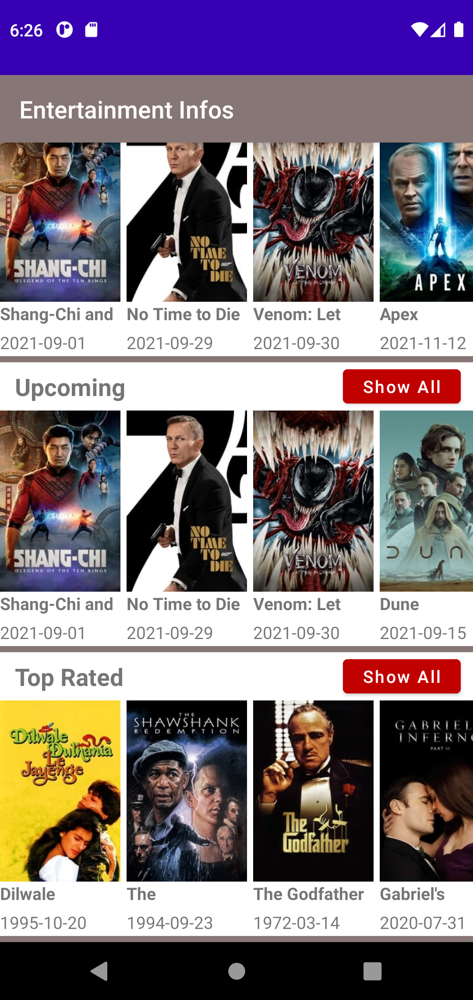
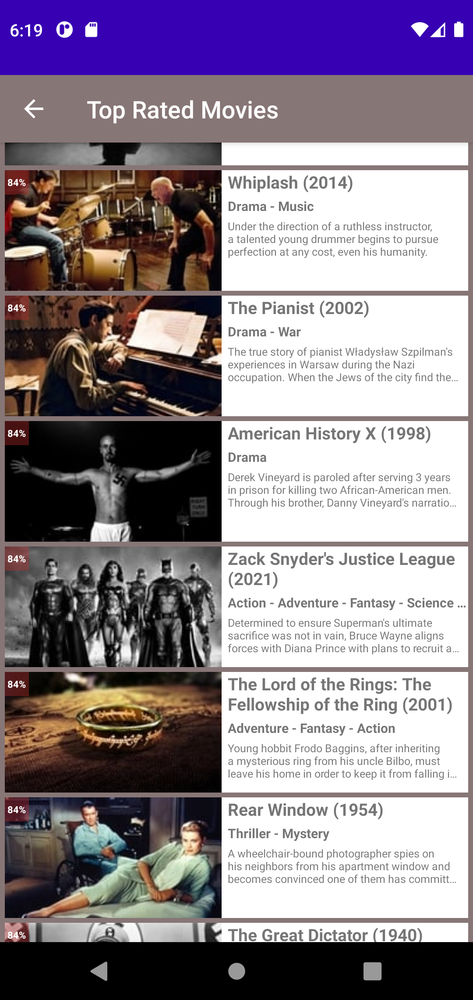
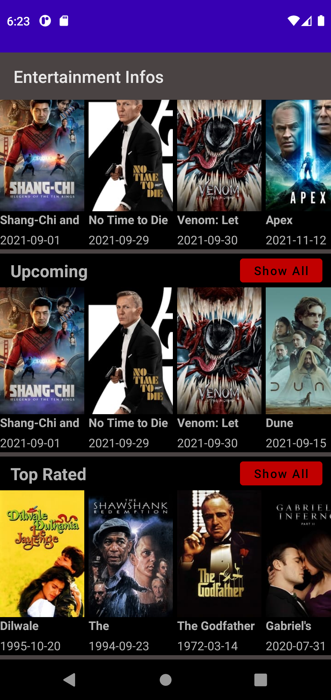
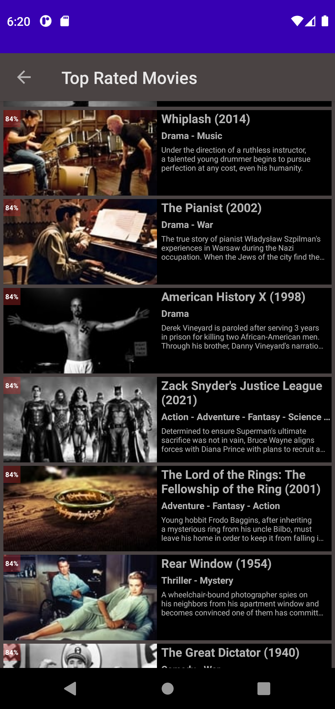

<h1>Entertainment Infos</h1>
<h2>Android App - refreshing my Android Skills and also showcasing</h2>
<h2 style="color:red;"><strong>Due to other priorities, Development Stopped</stong><h2>
<h3><strong>Used</strong> - Kotlin, Coroutines, Retrofit, Room-DB</h2>

<h2>Todos</h2>
<ul>
  <li>Add TMBD Login Functionality, Sync Bookmarks, WatchLists, User-Preferences</li>
  <li><del>Daily refresh Movie (Popular, Top-Rated...) APIs and update local db</de></li>
  <li>Add search option</li>
  <li>Learn & Optimize DB Structure, Query</li>
  <li>Use Kotlin Coroutines properly</li>
</ul>

<h2>Screenshot</h2>
<table>
  <tr>
    <th>Front Page</th>
    <th>Movie List Page</th>
  </tr>
  <tr>
    <td></td>
    <td></td>
  </tr>
  <tr>
    <td></td>
    <td></td>
  </tr>
</table>

Any suggestion regarding development is welcome!!!

<h2><strong>License</strong></h2>

Copyright (c) Asif Sanjary. All rights reserved.

Licensed under the <a href="https://github.com/asifsanjary/Entertainment_Infos/blob/master/LICENSE">MIT License</a> license.

